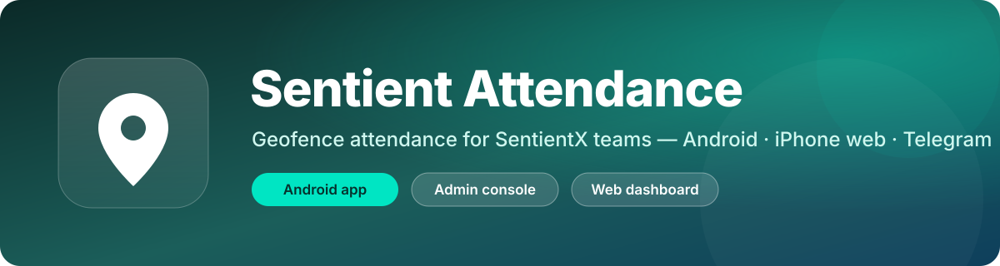
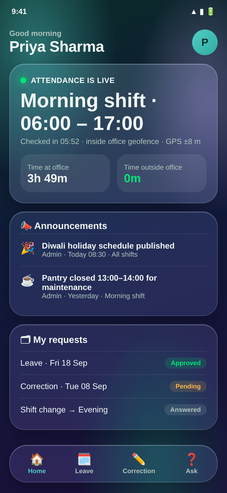
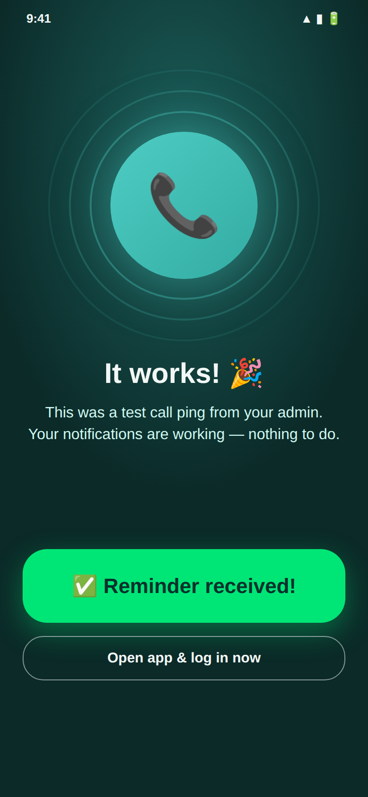
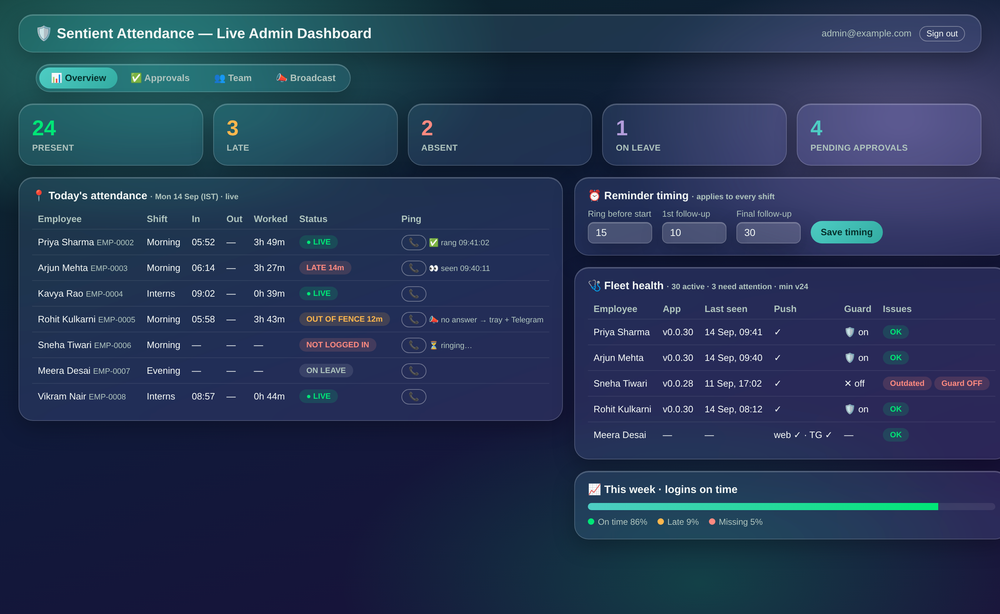

  

  
  
  
  

<h3 align="center">Official downloads for SentientX's internal attendance platform.</h3>

Tap <b>Login Today</b> at the office and the app does the rest: presence is verified against the office geofence for the length of your shift, and admins see the whole team live.

  <a href="https://github.com/MrRatsKant/sentient-attendance-releases/releases/download/v0.0.30/sentient-attendance-v0.0.30.apk"><b>⬇️ Employee app v0.0.30</b></a> &nbsp;·&nbsp;
  <a href="https://github.com/MrRatsKant/sentient-attendance-releases/releases/download/v0.0.30/attendance-admin-v0.0.30.apk"><b>🛡️ Admin app v0.0.30</b></a> &nbsp;·&nbsp;
  <a href="https://sentientx.web.app"><b>🌐 Install page</b></a> &nbsp;·&nbsp;
  <a href="https://sentientx.web.app/app/"><b>🍎 iPhone web app</b></a> &nbsp;·&nbsp;
  <a href="https://t.me/sentientx_attendance_bot"><b>✈️ Telegram bot</b></a>

---

## Screenshots

  
  &nbsp;&nbsp;
  

  

Illustrative renders with demo data. Names, times, and figures are fictional.

## Contents

- [Screenshots](#screenshots)
- [What it does](#what-it-does)
- [Install on Android](#install-on-android)
- [iPhone](#iphone)
- [Telegram attendance](#telegram-attendance)
- [Updating](#updating)
- [Permissions and privacy](#permissions-and-privacy)
- [For admins](#for-admins)
- [Release history](#release-history)
- [Support](#support)

## What it does

| | Employee app | Admin console and web dashboard |
|---|---|---|
| **Check-in** | One-tap *Login Today*, verified against the office geofence with GPS accuracy checks. Fake-GPS apps and emulators are rejected. | Live board of who is in, late, out of fence, or absent, updated in real time. |
| **During the shift** | Quiet background tracking inside the shift window only. Gaps and time outside the office are measured, never your route. | Per-employee day timelines, month calendars, worked-hours charts, and a payroll month summary with the late and cut-day policy applied. |
| **Reminders** | Rings like an incoming call before the shift if you haven't logged in, with follow-ups after start. Approved leave days stay silent. | Reminder timing is configurable from the dashboard. Per-employee **📞 ping** with delivery receipts: rang, silent, blocked, or seen. |
| **Requests** | Leave, correction, and shift-change requests plus questions to admin, with decisions shown in the app. | One-tap approvals with full decision history and an audit log. |
| **Communication** | Announcements arrive as push notifications. | Broadcasts to all shifts or one, and a Telegram digest every morning. |
| **Reliability** | Self-updating, survives battery-killer phones, optional uninstall protection, tamper-pinned timestamps. | Fleet health view: app version, last seen, push status, protection state, and one-click ping. |

Attendance is only recorded **at the office, inside your shift window**. Nothing is tracked off-shift.

## Install on Android

Requires Android 8.0 or newer. The app is distributed here rather than on the Play Store, so a one-time "unknown apps" permission is needed.

1. Download **[sentient-attendance-v0.0.30.apk](https://github.com/MrRatsKant/sentient-attendance-releases/releases/download/v0.0.30/sentient-attendance-v0.0.30.apk)**. If the browser warns about the file type, choose *Download anyway*.
2. Open the file from the notification shade or your Files app.
3. When asked, allow your browser to install unknown apps. Settings opens automatically: flip the toggle, then press back.
4. Tap **Install**. If Play Protect asks, choose *Install anyway*. This is SentientX's internal app.
5. Open the app and **create an account with your work email**. An admin approves you before tracking starts.
6. Grant the permissions the app asks for: location set to *Allow all the time*, notifications, and the battery exemption. Attendance cannot be recorded without them.

From then on the app updates itself. An **Update** card appears when a new version is out, and one tap installs it.

## iPhone

There is no native iPhone app yet. iPhone users check in from the web app.

1. Open **[sentientx.web.app/app](https://sentientx.web.app/app/)** in Safari and sign in.
2. Use Share → **Add to Home Screen** so it opens like an app.
3. At the office, tap **Login Today**. Leave and correction requests work the same way.

iPhones check in by button tap. Automatic background tracking is Android-only, so for automatic-style tracking on iPhone use Telegram below.

## Telegram attendance

Best for iPhone. One-time setup, then one tap per shift.

1. Install Telegram, open **[@sentientx_attendance_bot](https://t.me/sentientx_attendance_bot)**, and tap *Start*.
2. Link your account. In the web app or Android app, tap your round initial at the top right, then **✈️ Link Telegram**. The bot replies "✅ Linked".
3. Every shift, when you reach the office: **📎 → Location → Share Live Location → 8 hours**. The bot replies "🟢 Checked in" and keeps verifying you are at the office through the day.
4. When leaving, send **/out**.

A shift without live location is an untracked day, so make it a habit with your first chai.

## Updating

- **From v0.0.17 or newer:** install over the top, or tap the in-app Update card. No uninstall needed.
- **From v0.0.16 or older:** the app switched to its official signature at v0.0.17. Uninstall the old app once, install the new one, and sign in again. Your attendance history lives on the server, so nothing is lost.
- Versions below the fleet minimum show an update screen and will not run until updated.

## Permissions and privacy

| Permission | Why it is needed |
|---|---|
| Location, *Allow all the time* | Verifies you are inside the office geofence during your shift. Positions are only sampled inside the shift window. |
| Notifications | Shift reminders, admin pings, announcements, and decisions on your requests. |
| Battery exemption | Some phones kill background apps aggressively. Without it, tracking gaps appear. |
| Device admin, optional | *Attendance Protection* turns an accidental uninstall into a deliberate multi-step act and notifies your admin if it is switched off. |

A consent screen explains tracking before the home screen appears, in English and Hindi. Your route is never stored, only presence inside or outside the office perimeter.

## For admins

- **Admin app:** [attendance-admin-v0.0.30.apk](https://github.com/MrRatsKant/sentient-attendance-releases/releases/download/v0.0.30/attendance-admin-v0.0.30.apk). Approvals, roster, shifts, broadcasts, employee profiles, and per-employee ping.
- **Web dashboard:** [sentientx.web.app/admin](https://sentientx.web.app/admin/). Live boards, payroll summary, fleet health, reminder timing, and decision history.
- **Telegram:** a daily digest of check-ins and stragglers, plus alerts when the platform needs attention.

Admin access is granted by SentientX IT. Employee accounts cannot see the admin surfaces.

## Release history

Every release ships two APKs: `sentient-attendance-<version>.apk` for employees and `attendance-admin-<version>.apk` for admins. Full notes are on each release page. Versions are listed newest first. The v0.1.x and v0.2.0 tags were the August 2026 beta series; numbering restarted at v0.0.1 for the first official release, so the newest builds are the v0.0.x line.

| Version | Date | Highlights |
|---|---|---|
| [v0.0.30](https://github.com/MrRatsKant/sentient-attendance-releases/releases/tag/v0.0.30) | 2026-09-12 | Reminder timing is now admin-configurable (web dashboard → Reminder timing: ring lead + two follow-ups); the phone alarm follows the configured lead. |
| [v0.0.29](https://github.com/MrRatsKant/sentient-attendance-releases/releases/tag/v0.0.29) | 2026-09-12 | Ping delivery receipts: the phone now reports back whether an admin ping rang (or was silent/blocked) and when the ring screen was tapped. |
| [v0.0.28](https://github.com/MrRatsKant/sentient-attendance-releases/releases/tag/v0.0.28) | 2026-09-10 | Honest check-in state: amber 'Not checked in yet' card + 'Check in now' button while the shift window is open but no in-office fix was recorded (was shown as LIVE). |
| [v0.0.27](https://github.com/MrRatsKant/sentient-attendance-releases/releases/tag/v0.0.27) | 2026-09-10 | Tracking notice & consent screen (shown once, EN/HI) before home; records users.consentAt. |
| [v0.0.26](https://github.com/MrRatsKant/sentient-attendance-releases/releases/tag/v0.0.26) | 2026-09-07 | Uninstall protection (device admin) + leave-aware reminders: approved-leave days no longer ring. |
| [v0.0.25](https://github.com/MrRatsKant/sentient-attendance-releases/releases/tag/v0.0.25) | 2026-09-07 | Suggestion box for the next update (developer-only inbox) on the app and iPhone web app. |
| [v0.0.24](https://github.com/MrRatsKant/sentient-attendance-releases/releases/tag/v0.0.24) | 2026-09-07 | Bounded reminder rings (no more random/endless beeping), iPhone Telegram linking from the web app, admin-assigned employee code on every profile. |
| [v0.0.23](https://github.com/MrRatsKant/sentient-attendance-releases/releases/tag/v0.0.23) | 2026-08-18 | On-device reminder ladder (T-10 ring, start+10 and start+30 re-rings, all local alarms — OEM push throttling can't eat them) + OS-geofence 'you're at the office |
| [v0.0.22](https://github.com/MrRatsKant/sentient-attendance-releases/releases/tag/v0.0.22) | 2026-08-18 | Fleet version telemetry (users.appVc/appVn/appSeenAt on app open); pairs with worker-side ops alerts, digest hardening, and dead-token cleanup. |
| [v0.0.21](https://github.com/MrRatsKant/sentient-attendance-releases/releases/tag/v0.0.21) | 2026-08-08 | Critical fix: if your app still showed "Attendance is LIVE" from a previous day (old check-in time, old window), it will now close that stale day automatically |
| [v0.0.20](https://github.com/MrRatsKant/sentient-attendance-releases/releases/tag/v0.0.20) | 2026-08-07 | Employees (app + iPhone web): your leave/correction requests now show the decision, the admin's note, and status colors — right where you submitted them. |
| [v0.0.19](https://github.com/MrRatsKant/sentient-attendance-releases/releases/tag/v0.0.19) | 2026-08-07 | Admin: Approvals tab gains a 📜 History view — every decision ever made (signups, leaves, corrections, shift changes, answered questions) with who decided it, wh |
| [v0.0.18](https://github.com/MrRatsKant/sentient-attendance-releases/releases/tag/v0.0.18) | 2026-08-07 | Updating from v0.0.17: just install over the top — NO uninstall needed (same signature). |
| [v0.0.17](https://github.com/MrRatsKant/sentient-attendance-releases/releases/tag/v0.0.17) | 2026-08-06 | ONE-TIME REINSTALL REQUIRED: this version switches from debug to release signing. |
| [v0.0.16](https://github.com/MrRatsKant/sentient-attendance-releases/releases/tag/v0.0.16) | 2026-08-06 | Major performance fix (draw-phase animations — the jank is gone), hover glow on every web control, mobile admin employee profiles now match the web (month nav, |
| [v0.0.15](https://github.com/MrRatsKant/sentient-attendance-releases/releases/tag/v0.0.15) | 2026-08-06 | Full liquid-glass redesign: translucent glass surfaces over an animated aurora backdrop across both apps and all web pages, floating glass tab bars, and adaptiv |
| [v0.0.14](https://github.com/MrRatsKant/sentient-attendance-releases/releases/tag/v0.0.14) | 2026-08-06 | Platform-wide animation pass: animated tab transitions and staggered entrances in both apps, press-scale and pulse effects, reactive tabbed web dashboard with c |
| [v0.0.13](https://github.com/MrRatsKant/sentient-attendance-releases/releases/tag/v0.0.13) | 2026-08-05 | Push notifications now register per-device (works even where topic subscriptions fail); admin can call-ping any employee to test notifications. |
| [v0.0.12](https://github.com/MrRatsKant/sentient-attendance-releases/releases/tag/v0.0.12) | 2026-08-05 | The full-screen login reminder now plays a random cat video (12 bundled, offline-safe) while it rings. |
| [v0.0.11](https://github.com/MrRatsKant/sentient-attendance-releases/releases/tag/v0.0.11) | 2026-08-05 | Login reminder: tapping the alert anywhere opens the full-screen call screen with a big 'Reminder received' button; continuous vibration now uses alarm priority |
| [v0.0.10](https://github.com/MrRatsKant/sentient-attendance-releases/releases/tag/v0.0.10) | 2026-08-05 | 10 minutes before shift start the phone rings like an incoming call with continuous vibration until the employee logs in or dismisses. |
| [v0.0.9](https://github.com/MrRatsKant/sentient-attendance-releases/releases/tag/v0.0.9) | 2026-08-05 | Every dashboard row now shows login time, logout time, and hours worked (live 'so far' for people still checked in). |
| [v0.0.8](https://github.com/MrRatsKant/sentient-attendance-releases/releases/tag/v0.0.8) | 2026-08-04 | Admin shift-timing edits now reach employees instantly, even mid-shift: armed attendance windows re-resolve to the new timings live. |
| [v0.0.7](https://github.com/MrRatsKant/sentient-attendance-releases/releases/tag/v0.0.7) | 2026-08-04 | Employees: your profile is now a personal dashboard — full attendance history (all sources), editable name/phone, sign-in email change with verification, and pi |
| [v0.0.6](https://github.com/MrRatsKant/sentient-attendance-releases/releases/tag/v0.0.6) | 2026-08-04 | Admin approvals now show real employee names and dates, a 'View profile first' link opening the full employee dashboard, and per-employee monthly leave quota tr |
| [v0.0.5](https://github.com/MrRatsKant/sentient-attendance-releases/releases/tag/v0.0.5) | 2026-08-04 | Broadcasts now arrive as PUSH NOTIFICATIONS on every employee phone (update required to receive them). |
| [v0.0.4](https://github.com/MrRatsKant/sentient-attendance-releases/releases/tag/v0.0.4) | 2026-08-04 | Employees can now edit their own name and phone: Profile → tap your name card → ✏️ Edit (also in the iPhone web app). |
| [v0.0.3](https://github.com/MrRatsKant/sentient-attendance-releases/releases/tag/v0.0.3) | 2026-08-04 | Attendance now syncs to the server: check-ins, gaps, out-of-fence time and day status flow from each phone into secure per-day records (budget-capped writes, de |
| [v0.0.2](https://github.com/MrRatsKant/sentient-attendance-releases/releases/tag/v0.0.2) | 2026-08-04 | Fixes users stuck at the login page: interrupted signups now self-heal their profile (was an infinite spinner), clear human error messages (wrong password vs cr |
| [v0.0.1](https://github.com/MrRatsKant/sentient-attendance-releases/releases/tag/v0.0.1) | 2026-08-04 | First official (non-beta) release. |
| [v0.2.0](https://github.com/MrRatsKant/sentient-attendance-releases/releases/tag/v0.2.0) *(early beta)* | 2026-08-04 | Employee app redesigned: no tabs — one colorful page with a big Login Today button that verifies your GPS position against the office perimeter before marking a |
| [v0.1.6](https://github.com/MrRatsKant/sentient-attendance-releases/releases/tag/v0.1.6) *(early beta)* | 2026-08-04 | CRITICAL: fixes invisible text on the sign-in screen for dark-mode phones. |
| [v0.1.5](https://github.com/MrRatsKant/sentient-attendance-releases/releases/tag/v0.1.5) *(early beta)* | 2026-08-04 | Status pills across every screen: green ● LIVE (real server/tracking data) vs amber ● MOCK DATA (demo). |
| [v0.1.4](https://github.com/MrRatsKant/sentient-attendance-releases/releases/tag/v0.1.4) *(early beta)* | 2026-08-04 | Admin Dashboard is now an at-a-glance monitoring hub: team counts, needs-attention queue (tap → Approvals), roster grouped by shift with unassigned warnings, on |
| [v0.1.3](https://github.com/MrRatsKant/sentient-attendance-releases/releases/tag/v0.1.3) *(early beta)* | 2026-08-04 | Simple-language 6-page tutorial on first open (replayable from Profile). |
| [v0.1.2](https://github.com/MrRatsKant/sentient-attendance-releases/releases/tag/v0.1.2) *(early beta)* | 2026-08-04 | Admin app now has an amber shield icon (employee keeps the teal pin). |
| [v0.1.1](https://github.com/MrRatsKant/sentient-attendance-releases/releases/tag/v0.1.1) *(early beta)* | 2026-08-04 | All demo/mock data removed from live builds: real profile, real roster in admin, honest empty states until attendance sync ships. |
| [v0.1.0](https://github.com/MrRatsKant/sentient-attendance-releases/releases/tag/v0.1.0) *(early beta)* | 2026-08-04 | First beta: engine-driven attendance, live tracking (test mode), auth + approvals + broadcasts on Firebase. |

## Support

- Installation or sign-in problems: **ritik@sentientx.io**
- Password reset: use *Forgot password?* on the sign-in screen and check Spam or Junk for the email.
- Ideas: the in-app suggestion box on your profile.

Built by SentientX IT. Source code is maintained in a private repository. This repository holds releases only.

